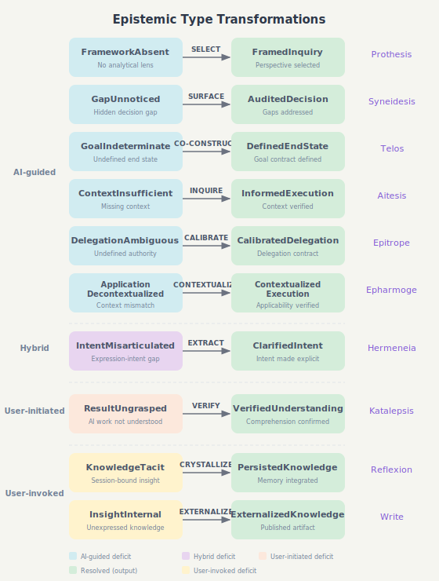

# Epistemic Protocols

> [한국어](./README_ko.md)

Claude Code plugins for epistemic dialogue — each protocol resolves a specific cognitive deficit through structured human-AI interaction.

## Protocols

| Protocol | Purpose | Timing |
|----------|---------|--------|
| **[Prothesis](./prothesis)** (πρόθεσις) — /frame | Team-based multi-perspective investigation | Before analysis |
| **[Syneidesis](./syneidesis)** (συνείδησις) — /gap | Surface potential gaps at decision points | At decision time |
| **[Hermeneia](./hermeneia)** (ἑρμηνεία) — /clarify | Clarify intent-expression gaps via dialogue | Before action |
| **[Katalepsis](./katalepsis)** (κατάληψις) — /grasp | Achieve certain comprehension of AI work | After AI action |
| **[Telos](./telos)** (τέλος) — /goal | Co-construct defined goals from vague intent | Pre-action |
| **[Aitesis](./aitesis)** (αἴτησις) — /inquire | Detect context insufficiency before execution | Pre-execution |
| **[Epitrope](./epitrope)** (ἐπιτροπή) — /calibrate | Context-adaptive delegation calibration through scenario-based interview | Pre-execution |

## Core Idea

Each protocol resolves a distinct cognitive deficit:

```
Protocol = (Deficit, Initiator, Operation, Operand) → Resolution
```

| Protocol | Deficit | Initiator | Operation | Type Signature |
|----------|---------|-----------|-----------|----------------|
| **Prothesis** | FrameworkAbsent | AI-guided | SELECT | `FrameworkAbsent → FramedInquiry` |
| **Syneidesis** | GapUnnoticed | AI-guided | SURFACE | `GapUnnoticed → AuditedDecision` |
| **Hermeneia** | IntentMisarticulated | Hybrid | EXTRACT | `IntentMisarticulated → ClarifiedIntent` |
| **Katalepsis** | ResultUngrasped | User-initiated | VERIFY | `ResultUngrasped → VerifiedUnderstanding` |
| **Telos** | GoalIndeterminate | AI-guided | CO-CONSTRUCT | `GoalIndeterminate → DefinedEndState` |
| **Aitesis** | ContextInsufficient | AI-guided | INQUIRE | `ContextInsufficient → InformedExecution` |
| **Epitrope** | DelegationAmbiguous | AI-guided | CALIBRATE | `DelegationAmbiguous → CalibratedDelegation` |
| **Epharmoge** | ApplicationDecontextualized | AI-guided | CONTEXTUALIZE | `ApplicationDecontextualized → ContextualizedExecution` |



- **Prothesis**: "How should we approach this?" → AI assembles a team, investigates from multiple perspectives, produces a framed inquiry (`FrameworkAbsent → FramedInquiry`)
- **Syneidesis**: "What's missing?" → AI surfaces gaps as questions, you judge (`GapUnnoticed → AuditedDecision`)
- **Hermeneia**: "What do I mean?" → AI presents interpretations, you recognize your intent; or AI detects ambiguity, you confirm and clarify (`IntentMisarticulated → ClarifiedIntent`)
- **Katalepsis**: "What did you do?" → AI verifies your understanding through questions (`ResultUngrasped → VerifiedUnderstanding`)
- **Telos**: "What do I actually want?" → AI proposes goals, you shape and approve (`GoalIndeterminate → DefinedEndState`)
- **Aitesis**: "Am I missing something?" → AI detects its own context insufficiency and inquires for missing information before proceeding (`ContextInsufficient → InformedExecution`)
- **Epitrope**: "How much should I handle?" → AI detects context, selects entry mode, calibrates delegation (WHO/WHAT/HOW MUCH) through scenarios (`DelegationAmbiguous → CalibratedDelegation`)
- **Epharmoge**: "Does this actually fit?" → AI evaluates whether correct output fits the actual context, surfaces mismatches for user judgment (`ApplicationDecontextualized → ContextualizedExecution`)

The key insight: **Recognition over Recall**. It's easier to select from presented options than to generate questions from scratch.

## Installation

```bash
# Add marketplace
/plugin marketplace add https://github.com/jongwony/epistemic-protocols

# Install what you need
/plugin install prothesis
/plugin install syneidesis
/plugin install hermeneia
/plugin install katalepsis
/plugin install telos
/plugin install aitesis
/plugin install epitrope
/plugin install epharmoge
```

## Codex Compatibility

Epistemic protocols can also be used as [Codex](https://github.com/openai/codex) skills:

```bash
python3 ~/.codex/skills/.system/skill-installer/scripts/install-skill-from-github.py \
  --repo jongwony/epistemic-protocols \
  --path aitesis/skills/inquire epitrope/skills/calibrate \
        hermeneia/skills/clarify katalepsis/skills/grasp syneidesis/skills/gap \
        telos/skills/goal
```

Run in **plan mode** for interactive protocol workflows that require user decisions at each phase.

> **Not yet supported in Codex**: Prothesis (`/frame`), Reflexion (`/reflect`), Write (`/write`) — these require agent teams and parallel subagents.

## Usage

```
/frame [your question]      # Multi-perspective team investigation
/gap [your task]             # Enable gap surfacing during execution
/clarify [your expression]   # Clarify ambiguous intent
/grasp                       # Verify understanding of AI work
/goal [your vague idea]      # Co-construct defined goals from intent
/inquire [your task]          # Detect and resolve context insufficiency before execution
/calibrate [your task]        # Context-adaptive delegation calibration through scenario-based interview
```

## License

MIT
