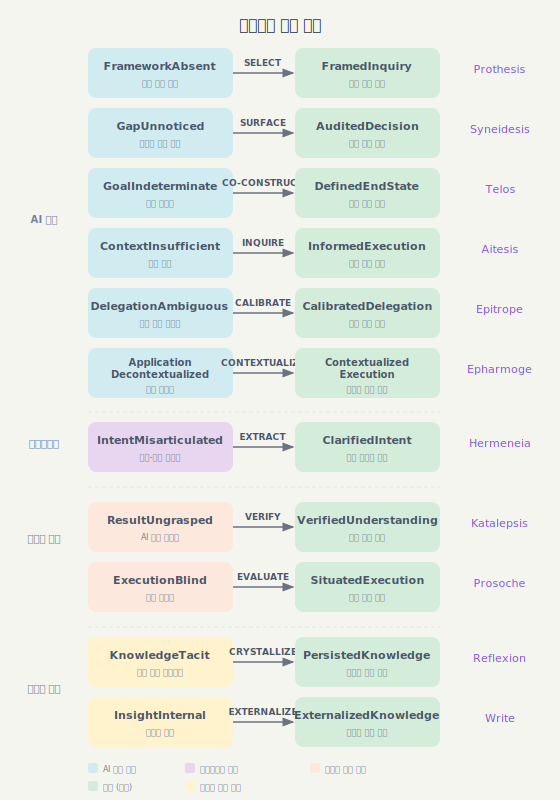

# Epistemic Protocols

> [English](./README.md)

각 프로토콜이 고유한 인지적 결핍을 해소하는 Claude Code 플러그인.

## 프로토콜

| 프로토콜 | 목적 | 적용 시점 |
|----------|------|----------|
| **[Prothesis](./prothesis)** (πρόθεσις) — /mission | 다관점 조사와 실행을 위한 팀 기반 분석 | 분석 시작 전 |
| **[Syneidesis](./syneidesis)** (συνείδησις) — /gap | 결정 지점에서 잠재적 갭 표면화 | 의사결정 시점 |
| **[Hermeneia](./hermeneia)** (ἑρμηνεία) — /clarify | 의도-표현 갭을 대화로 명확화 | 실행 전 |
| **[Katalepsis](./katalepsis)** (κατάληψις) — /grasp | AI 작업에 대한 확실한 이해 달성 | AI 작업 완료 후 |
| **[Telos](./telos)** (τέλος) — /goal | 모호한 의도에서 정의된 목표 공동 구성 | 실행 전 |
| **[Aitesis](./aitesis)** (αἴτησις) — /inquire | 실행 전 맥락 부족 감지 | 실행 전 |
| **[Epitrope](./epitrope)** (ἐπιτροπή) — /calibrate | 시나리오 인터뷰로 위임 자율성 캘리브레이션 | 실행 전 |

## 핵심 아이디어

각 프로토콜은 고유한 인지적 결핍을 해소합니다:

```
Protocol = (Deficit, Initiator, Operation, Operand) → Resolution
```

| 프로토콜 | 결핍 | 개시자 | 연산 | 타입 시그니처 |
|----------|------|--------|------|---------------|
| **Prothesis** | FrameworkAbsent | AI-detected | SELECT | `FrameworkAbsent → FramedInquiry` |
| **Syneidesis** | GapUnnoticed | AI-detected | SURFACE | `GapUnnoticed → AuditedDecision` |
| **Hermeneia** | IntentMisarticulated | User-initiated | EXTRACT | `IntentMisarticulated → ClarifiedIntent` |
| **Katalepsis** | ResultUngrasped | User-initiated | VERIFY | `ResultUngrasped → VerifiedUnderstanding` |
| **Telos** | GoalIndeterminate | AI-detected | CO-CONSTRUCT | `GoalIndeterminate → DefinedEndState` |
| **Aitesis** | ContextInsufficient | AI-detected | INQUIRE | `ContextInsufficient → InformedExecution` |
| **Epitrope** | DelegationAmbiguous | AI-detected | CALIBRATE | `DelegationAmbiguous → CalibratedAutonomy` |



- **Prothesis**: "어떻게 접근할까?" → AI가 팀을 구성해 다관점으로 조사하고, 발견 사항에 따라 실행 (`FrameworkAbsent → FramedInquiry`)
- **Syneidesis**: "뭘 놓쳤지?" → AI가 갭을 질문으로 표면화, 사용자가 판단 (`GapUnnoticed → AuditedDecision`)
- **Hermeneia**: "내가 뭘 말하려는 거지?" → AI가 해석 선택지 제시, 사용자가 의도 인식 (`IntentMisarticulated → ClarifiedIntent`)
- **Katalepsis**: "뭘 한 거야?" → AI가 질문으로 사용자의 이해를 검증 (`ResultUngrasped → VerifiedUnderstanding`)
- **Telos**: "내가 진짜 원하는 게 뭐지?" → AI가 목표를 제안, 사용자가 형성하고 승인 (`GoalIndeterminate → DefinedEndState`)
- **Aitesis**: "뭔가 빠진 건 아닐까?" → AI가 자체 맥락 부족을 감지하고, 실행 전 빠진 정보를 사용자에게 질의 (`ContextInsufficient → InformedExecution`)
- **Epitrope**: "어디까지 맡길까?" → AI가 시나리오 기반 질문으로 위임 경계를 캘리브레이션하여 세션 계약 생성 (`DelegationAmbiguous → CalibratedAutonomy`)

핵심 통찰: **Recall(회상)보다 Recognition(인지)**. 빈칸을 채우는 것보다 선택지에서 고르는 게 쉽습니다.

## 설치

```bash
# 마켓플레이스 등록
/plugin marketplace add https://github.com/jongwony/epistemic-protocols

# 필요한 것만 설치
/plugin install prothesis
/plugin install syneidesis
/plugin install hermeneia
/plugin install katalepsis
/plugin install telos
/plugin install aitesis
/plugin install epitrope
```

## 사용법

```
/mission [질문]      # 다관점 팀 조사 및 실행
/gap [작업]          # 실행 중 갭 표면화 활성화
/clarify [표현]      # 모호한 의도 명확화
/grasp               # AI 작업에 대한 이해 검증
/goal [모호한 아이디어]   # 의도에서 정의된 목표 공동 구성
/inquire [작업]          # 실행 전 맥락 부족 감지 및 해결
/calibrate [작업]        # 시나리오 인터뷰로 위임 자율성 캘리브레이션
```

## 라이선스

MIT
