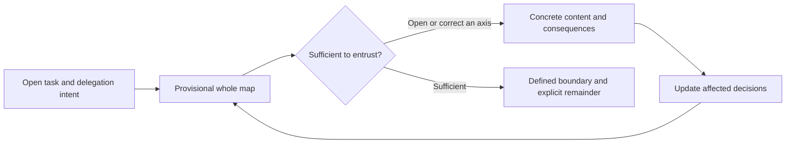

# Horismos — /bound (ὁρισμός)

Make the decisions in a task visible, then define what to retain, inspect, or entrust.

> [한국어](./README_ko.md)

A request to delegate can precede both a fixed goal and knowledge of the decisions involved. `/bound` starts by drafting the relevant whole structure from the available context. It shows why a decision matters, what it depends on, which parts already have a source-defined answer, and which are tentative or unknown.



The user can open any axis, inspect its proposed content, and change the framing before entrusting it. Different axes can receive different depths of examination. Opening one does not adopt its proposal or require reviewing every other one.

For example, a project map might show that the audience is already chosen, the data handling approach needs comparison, and the rollout date is still open. The user can inspect data handling, rule out external transmission, entrust the comparison work, and retain the final choice. The map then updates the affected options and keeps the rollout date unresolved. Finishing means this boundary is sufficient for the next move; it does not silently resolve every open project question.

The result is `BoundaryUndefined → DefinedBoundary`: a current map, its boundary question, explicit residue, and pointers to the records that settled it. A receiving agent must read those sources. Proposal work leaves selection with its holder; entrusted discretion permits choice within the actual grant. Required checkpoints in another protocol still apply.

## Install and use

```bash
claude plugin marketplace add https://github.com/jongwony/epistemic-protocols
claude plugin install horismos@epistemic-protocols
```

```text
/bound [the task or concern whose boundaries need defining]
```

## Contract and verification

- [SKILL.md](skills/bound/SKILL.md) defines provisional discovery, kind fit, progressive examination, source-bound settlement, and convergence.
- [Round composition](skills/bound/references/round-composition.md) supplies occasion-specific presentation rules.
- [Repository verification](../AGENTS.md#verification) gives contributor checks. Run these from the repository root, sequentially:

```bash
node .claude/skills/verify/scripts/static-checks.js .
node --test .claude/skills/verify/scripts/static-checks.test.mjs
node --test scripts/package.test.js
```

Static checks establish structural properties. Whether a dialogue makes an unfamiliar decision structure recognizable and respects the user's chosen depth requires inspecting actual interaction traces.
