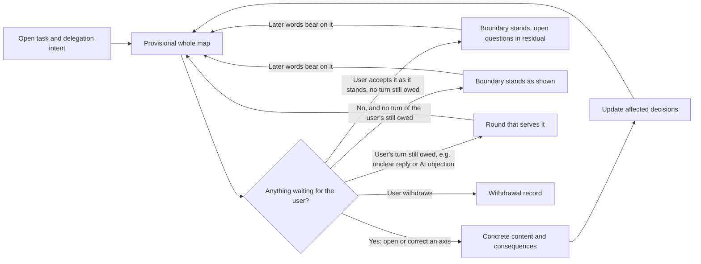

# Horismos — /bound (ὁρισμός)

Make the decisions in a task visible, then define what to retain, inspect, or entrust.

> [한국어](./README_ko.md)

A request to delegate can precede both a fixed goal and knowledge of the decisions involved. `/bound` starts by drafting the relevant whole structure from the available context. It shows why a decision matters, what it depends on, which parts already have a source-defined answer, and which are tentative or unknown.


```mermaid
flowchart LR
    A[Open task and delegation intent] --> B[Provisional whole map]
    B --> C{Anything waiting for the user?}
    C -->|Yes: open or correct an axis| D[Concrete content and consequences]
    D --> E[Update affected decisions]
    E --> B
    C -->|User accepts it as it stands, no turn still owed| F[Boundary stands, open questions in residual]
    C -->|No, and no turn of the user's still owed| G[Boundary stands as shown]
    C -->|User's turn still owed, e.g. unclear reply or AI objection| H[Round that serves it]
    H --> B
    C -->|User withdraws| W[Withdrawal record]
    F -->|Later words bear on it| B
    G -->|Later words bear on it| B
```

The user can open any axis, inspect its proposed content, and change the framing before entrusting it. Different axes can receive different depths of examination. Opening one does not adopt its proposal or require reviewing every other one. The boundary stands in one of two ways: the user accepts it as it stands, in whatever words, and it is set from what the conversation now holds; or no item on the map is waiting for the user, and it stands as shown, with what the map did not look at. Either way it stands only where no turn of the user's is still owed: an unclear answer or an AI objection they have not closed over, for instance, gets a round that serves it first; asking to see something just shows it, and a boundary that stands keeps standing. Any other answer continues or withdraws. The user's next words reopen a boundary that stands where they bear on it. Turning to other work closes nothing. An AI proposal becomes part of the boundary only when it was shown as the AI's, with its evidence and the AI's objections, if it had any, before the user took it.

For example, a project map might show that the audience is already chosen, the data handling approach needs comparison, and the rollout date is still open. The user can inspect data handling, rule out external transmission, entrust the comparison work, and retain the final choice. The map then updates the affected options and keeps the rollout date unresolved. A boundary that stands — whether the user accepted it or nothing was waiting for them — is sufficient for the next move; it does not silently resolve every open project question.

The result is `BoundaryUndefined → DefinedBoundary`: the current map with each decision's disposition — who put it forward and how it stood — the questions still open, each with why it matters and who settles it, what the map did not look at, the AI's recorded objections, and pointers to the records that settled it. A withdrawal leaves what the user's words now make, beside the boundary that last stood in the run, if one did. A receiving agent must read those sources. Proposal work leaves selection with its holder; entrusted discretion permits choice within the actual grant. Required checkpoints in another protocol still apply.

## Install and use

```bash
claude plugin marketplace add https://github.com/jongwony/epistemic-protocols
claude plugin install horismos@epistemic-protocols
```

```text
/bound [the task or concern whose boundaries need defining]
```

## Contract and verification

- [SKILL.md](skills/bound/SKILL.md) defines provisional discovery, progressive examination, source-bound settlement, and closing on the user's acceptance or on a map with nothing left for the user to dispose — as a Lean 4 block that elaborates.
- [Round composition](skills/bound/references/round-composition.md) supplies occasion-specific presentation rules.
- [Repository verification](../AGENTS.md#verification) gives the contributor workflow. For this plugin's static and packaging checks, run these from the repository root, sequentially:

```bash
node .claude/skills/verify/scripts/static-checks.js .
node --test .claude/skills/verify/scripts/static-checks.test.mjs
node --test scripts/package.test.js
```

Static checks establish structural properties. Whether a dialogue makes an unfamiliar decision structure recognizable and respects the user's chosen depth requires inspecting actual interaction traces.
