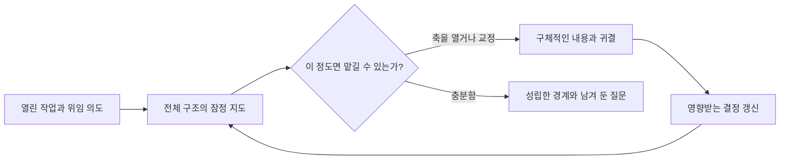

# Horismos — /bound (ὁρισμός)

작업에 담긴 결정을 먼저 드러내고, 무엇을 직접 판단하고 살펴보거나 맡길지 정합니다.

> [English](./README.md)

위임하고 싶다는 의도는 목표가 확정되거나 어떤 결정이 필요한지 알기 전에도 생깁니다. `/bound`는 주어진 맥락에서 관련 구조 전체의 초안을 먼저 만듭니다. 각 결정이 왜 필요한지, 무엇에 의존하는지, 어떤 부분이 출처에 따라 이미 정해졌고 어떤 부분이 잠정적이거나 미정인지 보여줍니다.



사용자는 어느 축이든 열어 잠정 내용을 살펴보고, 틀을 고친 뒤 맡길 수 있습니다. 축마다 살펴보는 깊이가 달라도 됩니다. 하나를 열었다고 그 제안을 채택하거나 나머지 모든 축을 확인해야 하는 것은 아닙니다.

예를 들어 프로젝트 지도에 대상 사용자는 이미 정해졌고, 데이터 처리 방식은 비교가 필요하며, 배포일은 미정이라고 표시할 수 있습니다. 사용자는 데이터 처리를 열어 외부 전송을 제외하고, 비교 작업을 맡기면서 최종 선택은 직접 하겠다고 정할 수 있습니다. 그러면 영향을 받는 후보를 갱신하고 배포일은 미정으로 남깁니다. 종료는 다음 진행에 이 경계면 충분하다는 뜻이며, 열린 프로젝트 질문을 모두 해결했다는 뜻이 아닙니다.

결과는 `BoundaryUndefined → DefinedBoundary`입니다. 현재 지도, 경계 질문, 남은 질문과 경계를 성립시킨 기록의 참조를 함께 전달합니다. 후속 에이전트는 그 출처를 읽어야 합니다. 제안 작업을 맡겨도 선택권은 보유자에게 남고, 재량을 맡긴 경우에는 실제 허용 범위 안에서 선택할 수 있습니다. 다른 프로토콜이 요구하는 체크포인트는 계속 적용됩니다.

## 설치와 사용

```bash
claude plugin marketplace add https://github.com/jongwony/epistemic-protocols
claude plugin install horismos@epistemic-protocols
```

```text
/bound [경계를 정의할 작업이나 관심사]
```

## 계약과 검증

- [SKILL.md](skills/bound/SKILL.md)는 잠정 구조의 발견, 경계 종류의 적합성, 점진적 검토, 출처에 따른 결정과 수렴을 정의합니다.
- [라운드 구성](skills/bound/references/round-composition.md)은 특정 상황에서 필요한 제시 규칙을 담습니다.
- [저장소 검증 지침](../AGENTS.md#verification)에 기여자용 작업 흐름이 있습니다. 이 플러그인의 정적 검사와 패키징 검증은 저장소 루트에서 다음 명령을 순서대로 실행합니다.

```bash
node .claude/skills/verify/scripts/static-checks.js .
node --test .claude/skills/verify/scripts/static-checks.test.mjs
node --test scripts/package.test.js
```

정적 검사는 구조적 속성을 확인합니다. 실제 대화가 낯선 결정 구조를 알아볼 수 있게 하고 사용자가 선택한 깊이를 지키는지는 실제 상호작용 기록을 읽어 검증해야 합니다.
